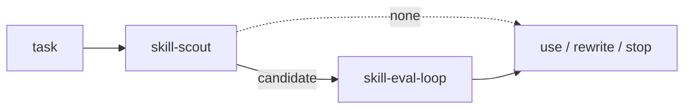

# tink-skills

Two evidence-oriented Agent Skills:

- **skill-scout** finds and qualifies existing skills before another one is
  created.
- **triangulate-me** pressure-tests interpretations without manufacturing false
  compromise.

Their evaluation corpora and provenance live beside them. Evaluation mechanics
are independently released from
[`jon-devlapaz/skill-eval-loop`](https://github.com/jon-devlapaz/skill-eval-loop).



## Install

Install the user-facing skills from this repository with
[Tink](https://github.com/jon-devlapaz/tink):

```console
tink skill add jon-devlapaz/tink-skills --skill skill-scout
tink skill add jon-devlapaz/tink-skills --skill triangulate-me
```

Install the evaluator from its own repository:

```console
tink skill add jon-devlapaz/skill-eval-loop --skill skill-eval-loop
tink skill check
```

Refresh every clean GitHub import with `tink skill refresh`, or refresh one by
name with `tink skill refresh NAME`. Do not hand-edit Tink source receipts.

## skill-scout

`skill-scout` ranks existing skills under workflow-fit, safety, and evidence
constraints. Its lightest applicable mode runs first, local candidates precede
online expansion, and no qualified candidate is a valid result.

Full contract: [`skills/skill-scout/SKILL.md`](skills/skill-scout/SKILL.md).

## triangulate-me

`triangulate-me` gives a claim faithful, steel, and stress readings, identifies
the material crux, and converges according to the evidence. It may endorse one
position, preserve a value disagreement, or abstain; it does not force a middle
ground.

Full contract: [`skills/triangulate-me/SKILL.md`](skills/triangulate-me/SKILL.md).

## Evaluate these skills

Install `skill-eval-loop`, then statically audit a suite without calling a
model:

```console
export SKILL_EVAL_DIR="$PWD/.agents/skills/skill-eval-loop"

python3 "$SKILL_EVAL_DIR/scripts/audit_suite.py" \
  --skill-path "$PWD/skills/triangulate-me"

python3 "$SKILL_EVAL_DIR/scripts/audit_suite.py" \
  --skill-path "$PWD/skills/skill-scout"
```

For paired live diagnostics, model-call authorization, harness support, and
interpretation limits, follow the
[`skill-eval-loop` contract](https://github.com/jon-devlapaz/skill-eval-loop/blob/v1.0.0/skills/skill-eval-loop/SKILL.md).

## Model

Each package is a `SKILL.md` plus its relative resources in
[Agent Skills](https://agentskills.io/specification) shape. Optional
`agents/openai.yaml` files provide Codex UI metadata.

```text
.
├── skills/
│   ├── skill-scout/
│   └── triangulate-me/
├── tools/
├── tests/
└── .github/workflows/
```

This repository owns two installable packages. It consumes the evaluator only
in CI at the full commit recorded in
[`validate.yml`](.github/workflows/validate.yml); no evaluator implementation is
vendored here.

## Promote reviewed live edits

The promotion tool accepts only the two repository-owned skills. Preview first,
then apply the exact reviewed snapshot:

```console
python3 tools/promote_live_skill.py --skill triangulate-me \
  --live-root .agents/skills

python3 tools/promote_live_skill.py --skill triangulate-me \
  --live-root .agents/skills --apply \
  --snapshot sha256:reviewed-digest
```

Apply refuses source or destination drift, builds a complete replacement before
swapping it, and never stages changes. Repository-only files are preserved.

## Release identity

Pull-request CI installs both repository skills and the pinned external
evaluator into isolated Tink state. The evaluator-owned identity verifier binds
each installed payload and receipt to the exact candidate repository and Git
commit, including executable modes.

This proves the checked-out candidate. A final release review should repeat the
same installation against the live canonical GitHub source.

## Develop

Install `skill-eval-loop` in this project or point `SKILL_EVAL_LOOP_ROOT` to a
verified checkout, then run:

```console
SKILL_EVAL_LOOP_ROOT="$PWD/.agents/skills/skill-eval-loop" \
  python3 -m unittest discover -s tests -v

python3 -m ruff check tools tests
```

CI: [`validate.yml`](.github/workflows/validate.yml).

## License

[MIT](LICENSE).
