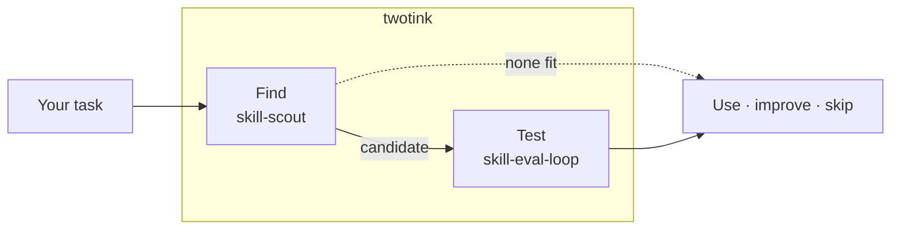

# twotink

Find, test, and improve agent skills.

twotink is a pair of agent skills.

`skill-scout` looks for skills that fit a specific job, compares the candidates,
and checks whether any are worth installing. It gives more weight to fit,
working examples, safety, and maintenance than to stars. If nothing holds up,
it says so.

`skill-eval-loop` checks whether a skill actually changes an agent's work. It
runs the same task with and without the skill while keeping the prompt, model,
tools, and trial settings fixed. The results are local evidence, not proof that
the skill will work everywhere.



`skill-scout` only researches and recommends. It will not install a candidate,
change your configuration, publish anything, or run code from a candidate
without separate permission.

## Install

### Skills CLI

Install either skill with the [Skills CLI](https://skills.sh/):

```sh
npx skills add jon-devlapaz/twotink --skill skill-scout \
  --agent codex cursor claude-code hermes-agent pi -g -y --copy

npx skills add jon-devlapaz/twotink --skill skill-eval-loop \
  --agent codex cursor claude-code hermes-agent pi -g -y --copy
```

You can add other compatible agents, including `gemini-cli`, `github-copilot`,
and `opencode`, to the `--agent` list.

> [!IMPORTANT]
> The Hermes community registry has a different package named `skill-scout`.
> Use the repository command above or install this copy manually. Running
> `hermes skills install skill-scout` installs the other package.

### Manual install

Clone this repository and copy or symlink the skill you want into your agent's
personal skill directory:

| Agent | Personal skill directory |
| --- | --- |
| Codex | `~/.agents/skills/<skill-name>` |
| Cursor | `~/.cursor/skills/<skill-name>` |
| Claude Code | `~/.claude/skills/<skill-name>` |
| Hermes Agent | `~/.hermes/skills/<skill-name>` |
| Pi | `~/.pi/agent/skills/<skill-name>` or `~/.agents/skills/<skill-name>` |

For a project-only install, use the matching directory inside the project,
such as `.agents/skills`, `.cursor/skills`, `.claude/skills`, or `.pi/skills`.

With [Tink](https://github.com/jon-devlapaz/tink), you can install both skills
into a project's `.agents/skills/` in one step:

```sh
tink init --with-twotink
# or, later:
tink skill add jon-devlapaz/twotink --skill skill-scout
tink skill add jon-devlapaz/twotink --skill skill-eval-loop
```

Pi can also install the repository as a package:

```sh
pi install git:github.com/jon-devlapaz/twotink
```

## Use `skill-scout`

When the same kind of job keeps coming up, ask your agent to find a suitable
skill. Depending on the agent, you might invoke it as `$skill-scout`,
`/skill-scout`, or `/skill:skill-scout`.

```text
Use skill-scout to find a maintained skill for reviewing database migrations.
Compare these two supplied skills without searching for more candidates.
Check whether this skill repository is safe and compatible with my agent.
```

In DISCOVER mode, scout checks this project's `.agents/skills/` first
(non-redundancy), then public sources. Cross-project reuse via Tink's
`~/.tink/skills/by-project/*/meta.json` catalog is **on request only** (when you
ask about other projects). Scout does not install anything; when Tink is
available it prefers proposing `tink skill add …` as the next approved gate.

## Use `skill-eval-loop`

Run `skill-eval-loop` when you want to know whether a skill makes a difference.
Most skills do not come with an eval suite. In that case, a fresh subagent
writes one and keeps its hidden cases away from the coordinating chat. This
reduces the chance that the main agent learns the answers while it works.

The workflow asks one question at a time. You choose the harness first: Hermes,
Claude Code, Codex, or Pi. It checks which models that harness can use, then
suggests budget, balanced, and quality options. You confirm the exact model
before anything runs.

The first live check is one paired trial. You can watch it through Herdr or let
it run headlessly. The dry run is free and creates no artifacts. Before it
spends anything, the skill shows the target and judge commands and waits for
your approval. One agent invocation can make several provider calls, especially
when model graders are involved, so read that preview before confirming.

```text
Use skill-eval-loop to test this skill against a no-skill control.
Run a quick diagnostic of this skill with Codex.
Test whether this skill works across the available Pi model tiers.
```

## What works where

Both skills follow the open [Agent Skills specification](https://agentskills.io/specification):
a `SKILL.md` file, relative references, and optional metadata.
[Codex](https://learn.chatgpt.com/docs/build-skills),
[Claude Code](https://code.claude.com/docs/en/skills),
[Hermes Agent](https://github.com/NousResearch/hermes-agent/blob/main/website/docs/guides/work-with-skills.md),
and [Pi](https://github.com/badlogic/pi-mono/blob/main/packages/coding-agent/docs/skills.md)
all understand this package shape. [Cursor](https://www.cursor.com/changelog/2-4)
supports Agent Skills in its editor and CLI too.

The `agents/openai.yaml` files add Codex UI metadata. Other agents can ignore
them. Tool access still differs between agents, so compatibility means the
agent can find and read the skill. It does not mean every optional integration
is installed.

## Repository layout

```text
skills/skill-scout/
├── SKILL.md
├── agents/openai.yaml
├── references/scouting-workflow.md
└── evals/

skills/skill-eval-loop/
├── SKILL.md
├── agents/openai.yaml
├── references/
├── scripts/
└── tests/
```

## Maintaining these skills

The repository is the published copy. Your local `.agents` version is the
working copy. When a change is ready to publish, promote one skill at a time:

1. Work in `~/.agents/skills/<skill-name>` and test the change there.
2. Preview the differences. This does not write anything.

   ```sh
   python3 tools/promote_live_skill.py --skill skill-eval-loop
   ```

3. Read the diff and make sure it covers only the skill and changes you meant
   to publish.
4. Copy the reviewed changes into this repository.

   ```sh
   python3 tools/promote_live_skill.py --skill skill-eval-loop --apply
   ```

5. Run that skill's tests and package checks, then read `git diff`.
6. Commit and push only after that review.
7. If review changed the repository copy, reinstall it before the next live
   experiment:

   ```sh
   npx skills add . --skill skill-eval-loop --agent codex -g -y --copy
   ```

The promotion command copies additions and edits, but it does not mirror
deletions. It also leaves staging, commits, tags, and publication to you.

## License

[MIT](LICENSE)
